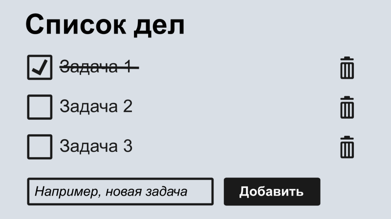

Веб-приложение "To-Do List" (Классика)
Цель: Отработка базового workflow: issues, ветки, PR, ревью, деплой.
Стек: HTML, CSS, JS (или React/Vue), опционально любой бэкенд.
План:
1.	Планирование, создание репозитория, бэклога (Trello/GitHub Projects).
2.	Разработка базовой верстки и функционала добавления задачи.
3.	Реализация удаления и отметки о выполнении. Первые PR и код-ревью.
4.	Добавление фильтрации (Все/Активные/Завершенные).
5.	Рефакторинг, тестирование, работа с конфликтами.
6.	Деплой на GitHub Pages/Netlify и ретроспектива.

Команда:
1. msluganskiy Луганский Михаил
2. vinsproduction Поляков Василий
3. Alexnoch Хараин Александр

Backlog (План разработки)

### Frontend
1. [Разработка каркаса приложения (react).](https://ru.yougile.com/team/e7dc20e21c4e/#chat:106bca785c1d)
2. [Создание методов редактирования, сохранения, удаления заметок (API)](https://ru.yougile.com/team/e7dc20e21c4e/#chat:986453b9ff2c)
3. [CSS наведение красоты](https://ru.yougile.com/team/e7dc20e21c4e/#chat:6c5dd990219e)

### Backend
1. [Создание сервера nodjs + express](https://ru.yougile.com/team/e7dc20e21c4e/#chat:eb14ca37da35)
2. [Создание endpont'ов для Fronend'a](https://ru.yougile.com/team/e7dc20e21c4e/#chat:568fb084d0fe)

### Прототип проекта

 

